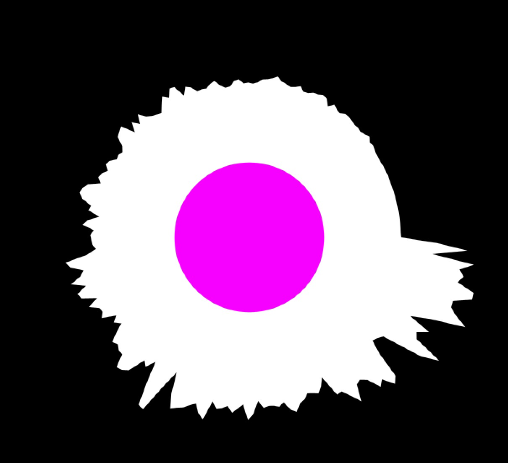
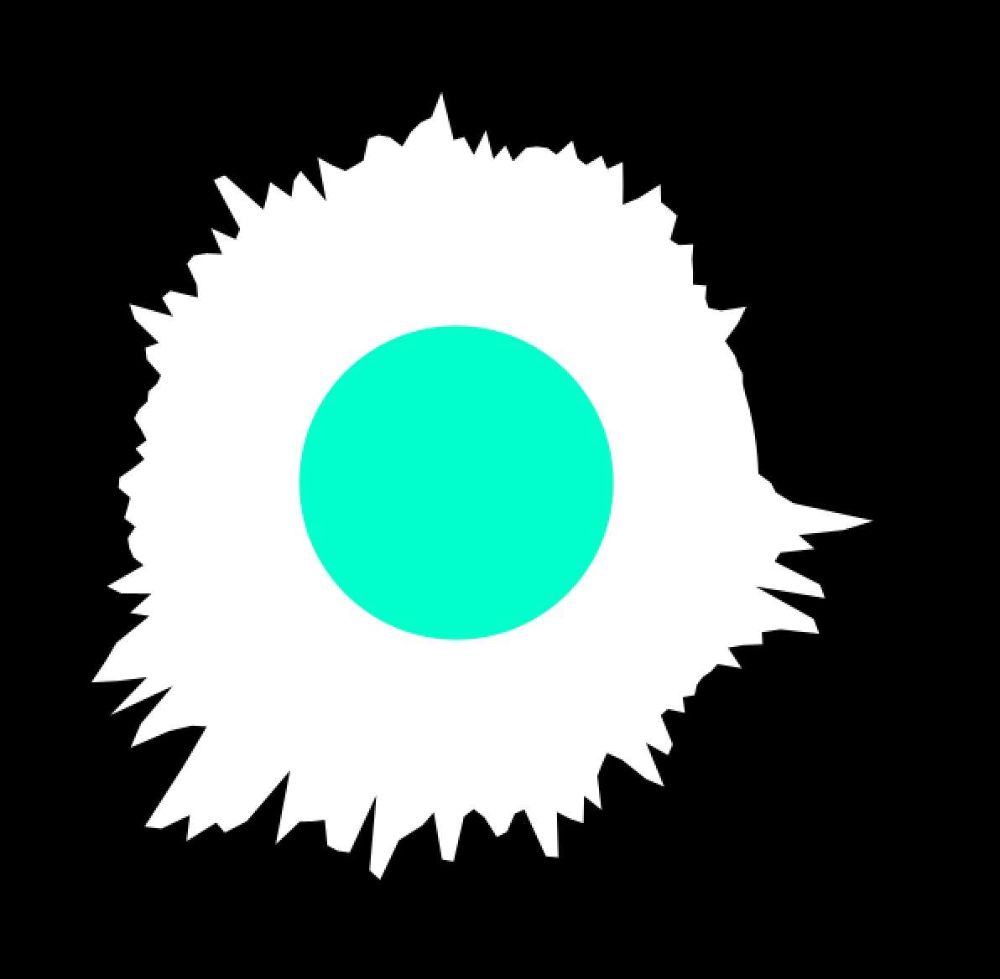
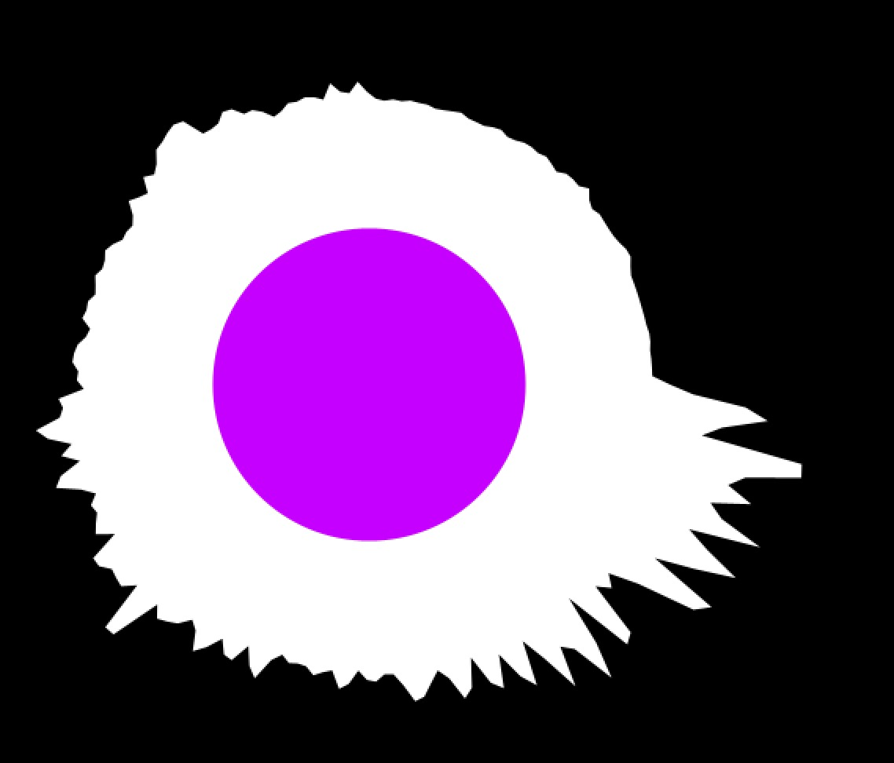
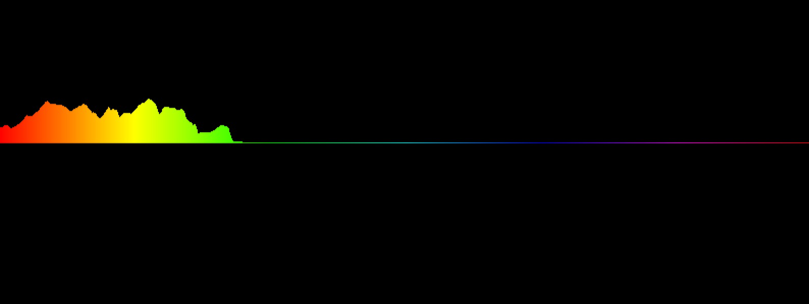
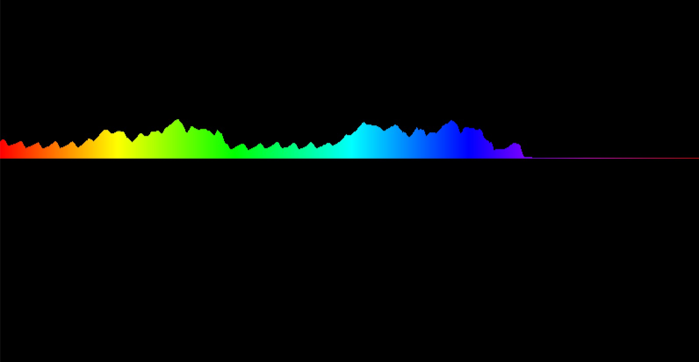
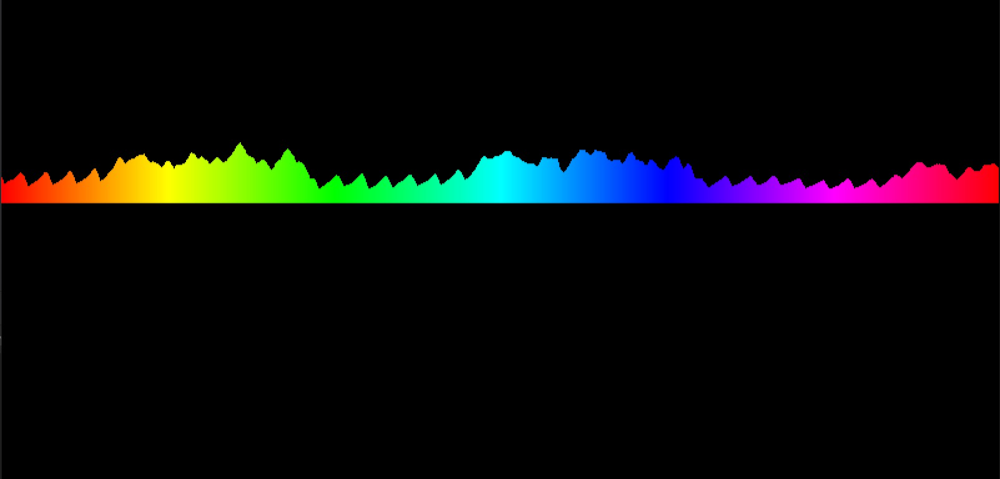
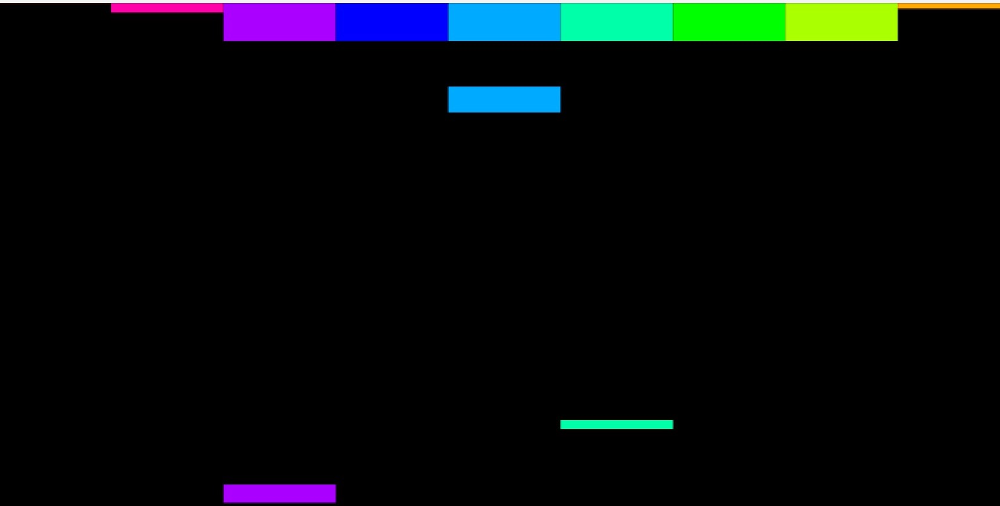
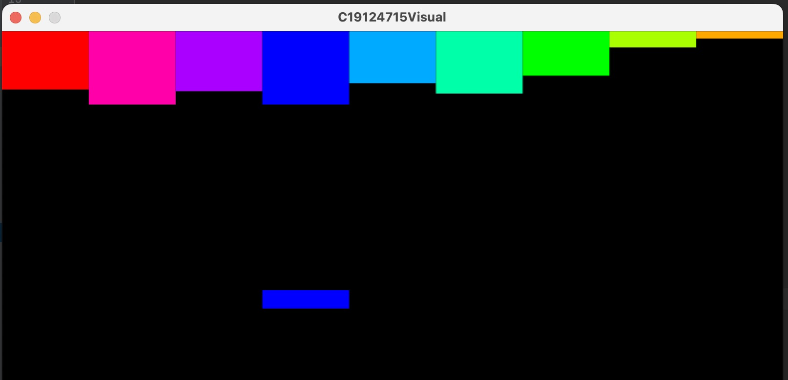
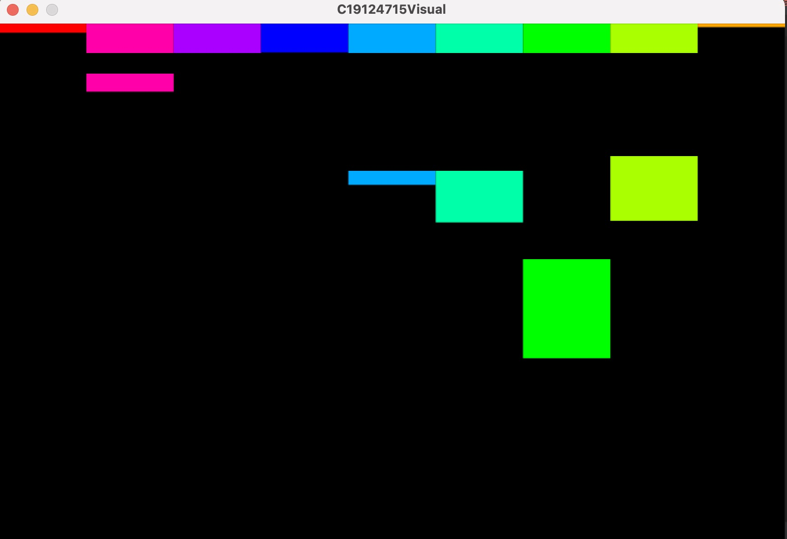

# Music Visualiser Project

Name: Zihao Zhao

Student Number: d19124715

## Instructions
- Fork this repository and use it a starter project for your assignment
- Create a new package named your student number and put all your code in this package.
- You should start by creating a subclass of ie.tudublin.Visual
- There is an example visualiser called MyVisual in the example package
- Check out the WaveForm and AudioBandsVisual for examples of how to call the Processing functions from other classes that are not subclasses of PApplet

# Description of the assignment
What I achieve:
1. Use version control tool (git) to independently complete this project
2. Use polymorphism and inheritance
3. Use Minim library to process music and Processing library for visualization
4. Three different types of rendering effects
5. Visualization effects based on rhythm and beat


# Instructions


# How it works


# What I am most proud of in the assignment
For the first time, I tried using library functions related to music processing and gained a deeper understanding of music visualization. 
I learned about the greatness of the FFT algorithm, which not only applies to sound processing but also to the processing of many signals, including images and other information.

# Development Logs
### 3-15 First successful attempt at music visualization
- Start experimenting with the Processing and Minin library
- Familiar with FFT and use FFT to generate frequency-amplitude diagrams

The effect is **as follows**, the effect is as follows, the circle in the middle will automatically change color randomly, and the surrounding wave circle is the image generated by FFT
||||
| :-----:| :----: | :----:|

### 3-19 BeatDetect function is used
In the following code, I try to use the library function to get the beat of the music. By adjusting the parameter size of **setSensitivity()** to get the beat of the music successfully.
```Java
BeatDetect beat;
beat = new BeatDetect(cv.getFrameSize(), cv.getSampleRate());
// beat = new BeatDetect();
beat.detectMode(BeatDetect.SOUND_ENERGY);
beat.setSensitivity(300);//I recommend a size between 200 and 500.

```
- Reference: 
    1. [Minim examples of beat detection and related functions](https://github.com/ddf/Minim/blob/main/examples/Analysis/FrequencyEnergyBeatDetection/FrequencyEnergyBeatDetection.pde)
    2.  [Document of Minim BeatDetect](https://code.compartmental.net/minim/beatdetect_class_beatdetect.html)
### 4-3 A new module(Time domain graph) for visualization
- some optimizations and bugs fixed.
- The implementation of a new idea —— **<u>*parallel shift of the time domain graph*</u>.**
- Currently thinking of ways to integrate strong beats into visual displays.
- Added a new music (mp3) with a stronger rhythm.

||||
| :-----:| :----: | :----:|

 <font size=2>BTW I don't think the effect is good ：E</font>

### 4-15 Added a new module(cube drop) and optimized several old modules

- Frequency domain graphs with 10 bins
- Cubes will randomly drop!
- *Plan to make a small game —— catch the cubes！*

The effect is as follows.

||||
| :-----:| :----: | :----:|

### 4-18 Adding polymorphism and inheritance to the design
***Core idea***: The three previously implemented visualization classes have different final rendering effects. Considering that they all have commonalities - they all need to be rendered. A base class 'Visual' is constructed, and the three visualization classes inherit from 'Visual'. The 'Visual' class has an empty implementation of the render function, which is overridden in each of the three visualization classes. Polymorphism is achieved through construction and function calls as follows.

```Java
//Base class refer to different derived classes.
Visual v1 = new WaveVisual();
Visual v2 = new RoundVisual();
Visual v3 = new TestVisual();
//Polymorphic
v1.render();    
v2.render();    
v3.render();   
//... 
```
- Complete part of the \<***Description of the assignment***\> writing
- Complete part of the \<***What I am most proud of in the assignment***\> writing
### Notice: I have switched to this current github account and will mainly run all future projects from here.

# Markdown Tutorial

This is an image using a relative URL:


This is an image using an absolute URL:


This is a youtube video:

[](https://www.youtube.com/watch?v=J2kHSSFA4NU)

This is a table:

| Heading 1 | Heading 2 |
|-----------|-----------|
|Some stuff | Some more stuff in this column |
|Some stuff | Some more stuff in this column |
|Some stuff | Some more stuff in this column |
|Some stuff | Some more stuff in this column |

