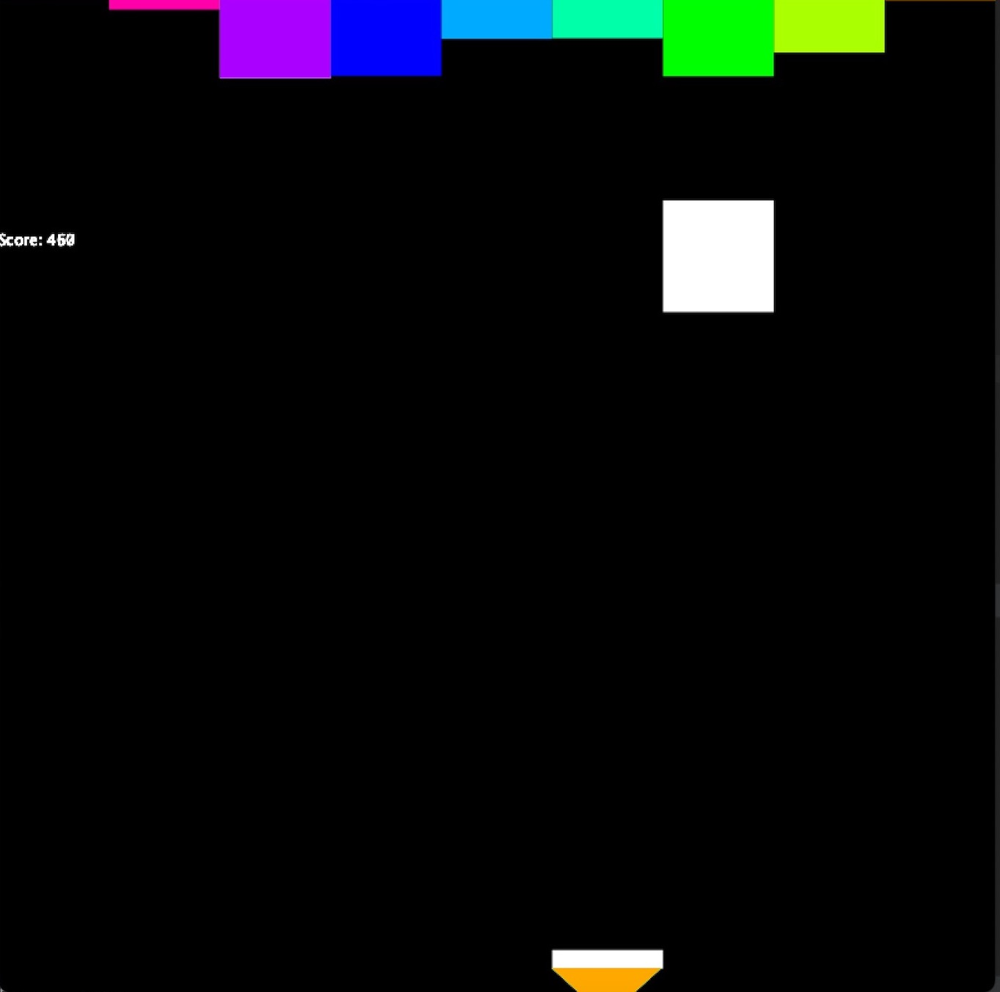
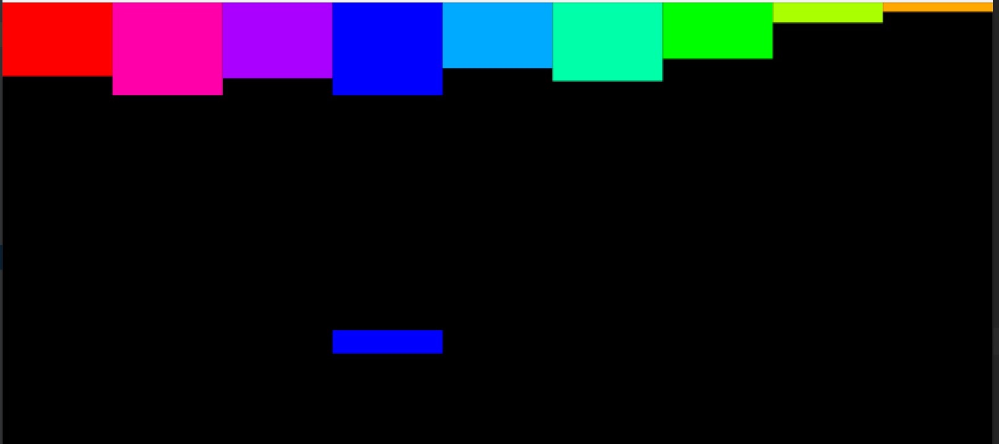
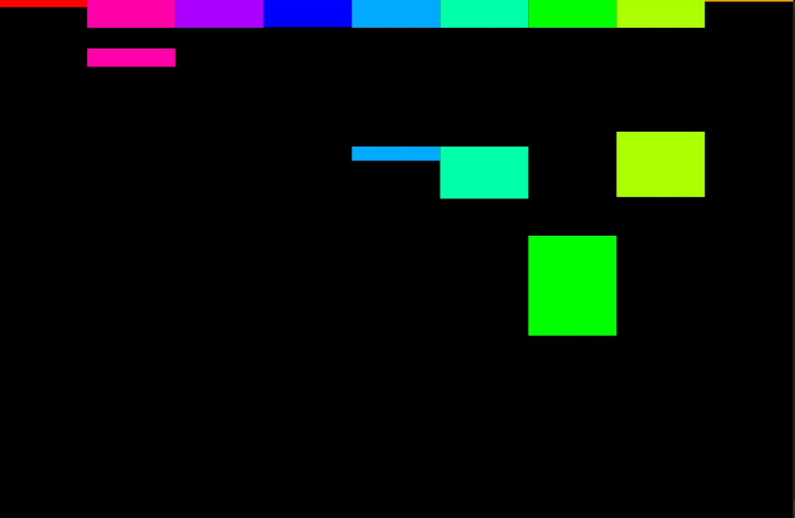
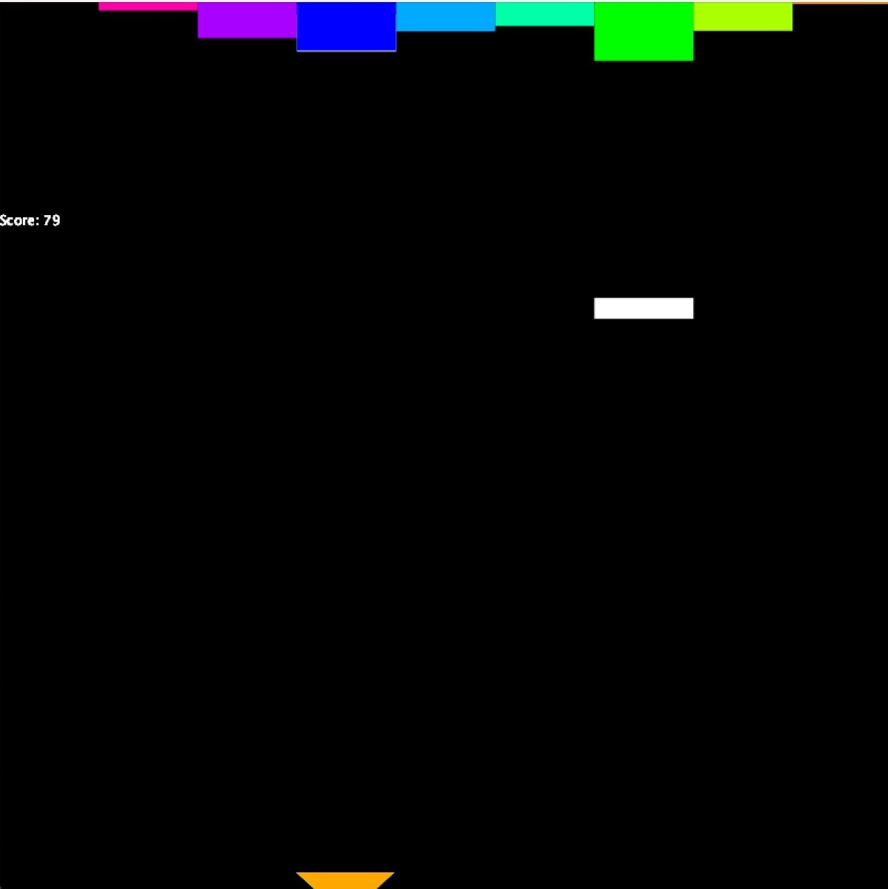

# Music Visualiser Project

Name: Zihao Zhao

Student Number: D19124715

<!--## Instructions
- Fork this repository and use it a starter project for your assignment
- Create a new package named your student number and put all your code in this package.
- You should start by creating a subclass of ie.tudublin.Visual
- There is an example visualiser called MyVisual in the example package
- Check out the WaveForm and AudioBandsVisual for examples of how to call the Processing functions from other classes that are not subclasses of PApplet-->
## Youtube Video
This is the youtube video link:xxx
<!--[](https://www.youtube.com/watch?v=J2kHSSFA4NU)-->


# Description of the assignment
## What I achieve:
1. Use version control tool (**<u>Git</u>**) to independently complete this project
2. Use <u>**polymorphism**</u> and **<u>inheritance</u>**
3. Use Minim library to process music and Processing library for visualization
4. **<u>Three</u>** different types of rendering effects
5. Visualization effects based on <u>**rhythm and beat**</u>
6. Converting polar coordinates to Cartesian coordinates using "**PVectors**"
7. Design and implementation of mini-games with human-computer interaction (using the keyboard)

||||
| :-----:| :----: | :----:|
# Instructions
## Environment Setup and Code Execution
- All code only uses libraries that are already included in the current project, no additional libraries have been added.
- Once the Java environment is properly configured, this project can be run.


## Guide to this program
- There are three visualization modes, you can switch between them by pressing keys 1, 2, and 3 after running the program.
- Press the 'space' to play music and start visualizing.
- Mode 3 is a mini-game, where you control a basket to catch music blocks and score higher by pressing the "a" key (left) or "d" key (right).

# How it works
## Overview
This project mainly designs a **'D19124715Visual'** class inherited from **'Visual'** class, an abstract class (**'Render'**), and three visualization classes (**'RoundVisual', 'WaveVisual', 'DropVisual'**) derived from the Render class.

**To explain how my project works, I will use some software engineering diagrams below.**
## Function Module Diagram and UML Class Diagram
-  UML Class Diagram

As shown in the figure above, Render is an abstract class that has a render function. All classes of visualization modules will inherit from this class and override the render function. The D19124715Visual class has an array of render classes, and objects in this array can store any objects derived from the Render class.


- Function module diagram


## Design Philosophy
1. Module I(RoundVisual)
    - Integrating the rhythm into music visualization, the size and color of the ball change with the beat, adding a sense of rhythm.
    - Adopting a symmetric design can reduce the significant difference between high and low frequencies caused by the missing high frequency part, which is not aesthetically pleasing.
2. Module II(WaveVisual)
    - Plot the smoothed music waveform on an Archimedean spiral.
    - Instead of coding the general equation of the spiral(equations below), I used PVector to convert the coordinate system. This allowed me to represent the Archimedean spiral using polar coordinates easily.
3. Module III(DropVisual)
Design rules for music block falling:
    - The fall of the music block depends on the **beat**
    - At the current time t, the probability of music blocks falling is p, where the larger the proportion of a certain frequency band at that time (the larger the area), the greater the probability (p value) of the block falling.
    - The score is proportional to the area of the block caught.
    - The blocks fall from the top at a certain acceleration rate.


# What I am most proud of in the assignment
For the first time, I tried using library functions related to music processing and gained a deeper understanding of music visualization. 

I learned about the greatness of the FFT algorithm, which not only applies to sound processing but also to the processing of many signals, including images and other information.


Learn how to use Git and GitHub. Though done alone, I also learned how to use Git to control and archive versions. In the event of an unknown accident, it's possible to quickly revert to a stable version through Git revert, checkout, and reset operations.

Implemented simple (but very useful) inheritance and polymorphism using Java. Have a preliminary understanding and exposure to design patterns.
# Development Logs(Timeline)
### 3-15 First successful attempt at music visualization
- Start experimenting with the Processing and Minin library
- Familiar with FFT and use FFT to generate frequency-amplitude diagrams

The effect is **as follows**, the effect is as follows, the circle in the middle will automatically change color randomly, and the surrounding wave circle is the image generated by FFT
||||
| :-----:| :----: | :----:|

### 3-19 BeatDetect function is used
In the following code, I try to use the library function to get the beat of the music. By adjusting the parameter size of **setSensitivity()** to get the beat of the music successfully.
```Java
BeatDetect beat;
beat = new BeatDetect(cv.getFrameSize(), cv.getSampleRate());
// beat = new BeatDetect();
beat.detectMode(BeatDetect.SOUND_ENERGY);
beat.setSensitivity(300);//I recommend a size between 200 and 500.

```
- Reference: 
    1. [Minim examples of beat detection and related functions](https://github.com/ddf/Minim/blob/main/examples/Analysis/FrequencyEnergyBeatDetection/FrequencyEnergyBeatDetection.pde)
    2.  [Document of Minim BeatDetect](https://code.compartmental.net/minim/beatdetect_class_beatdetect.html)
### 4-3 A new module(Time domain graph) for visualization
- some optimizations and bugs fixed.
- The implementation of a new idea —— **<u>*parallel shift of the time domain graph*</u>.**
- Currently thinking of ways to integrate strong beats into visual displays.
- Added a new music (mp3) with a stronger rhythm.

||||
| :-----:| :----: | :----:|

 <font size=2>BTW I don't think the effect is good ：E</font>

### 4-15 Added a new module(cube drop) and optimized several old modules

- Frequency domain graphs with 10 bins
- Cubes will randomly drop!
- *Plan to make a small game —— catch the cubes！*

The effect is as follows.

||||
| :-----:| :----: | :----:|

### 4-18 Adding polymorphism and inheritance to the design
***Core idea***: The three previously implemented visualization classes have different final rendering effects. Considering that they all have commonalities - they all need to be rendered. A base class 'Render' is constructed, and the three visualization classes inherit from 'Render'. The 'Render' class has an empty implementation of the render function, which is overridden in each of the three visualization classes. Polymorphism is achieved through construction and function calls as follows.

```Java
//Base class refer to different derived classes.
Visual v1 = new WaveVisual();
Visual v2 = new RoundVisual();
Visual v3 = new TestVisual();
//Polymorphic
v1.render();    
v2.render();    
v3.render();   
//... 
```
- Complete part of the \<***Description of the assignment***\> writing
- Complete part of the \<***What I am most proud of in the assignment***\> writing

### 4-20 Bug fixed and module optimizations 
- 
- Youtube video is in the plan.(three effects will be shown, but some visual effects still need to be optimized before the final pre)

### Notice: I have switched to this current github account and will mainly run all future projects from here.

### 4-22 ***Huge Improvement on two modules***

1. Adding new gameplay in cube drop
    - Game introduction: To move the basket left and right and catch more falling music blocks, use the 'A' and 'D' keys.
    - Design rules for music block falling:
        - At the current time t, the probability of music blocks falling is p, where the larger the proportion of a certain frequency band at that time (the larger the area), the greater the probability (p value) of the block falling.
        - The score is proportional to the area of the block caught.
        - The blocks fall from the top at a certain acceleration rate.
        
||||
| :-----:| :----: | :----:|

2. Change the design of the second visualization module (Time domain graph)
    - Use a spiral design instead of a tiled straight line.
    - Smooth the original waveform instead of using FFT.
    - use the Archimedean spiral with the following polar coordinates equation: $r = a + b \cdot \theta$
   
Instead of coding the general equation of the spiral(equations below), I used PVector to convert the coordinate system. This allowed me to represent the Archimedean spiral using polar coordinates easily.
    $$ \left.\begin{array}{l} { w _ { 0 } = \sqrt { x ^ { 2 } + \omega ^ { 2 } ( t + e ^ { 2 } } ) } \\ { v _ { r } = v \cos \omega + \omega ( t + \infty ) \sin a } \\ { s _ { 3 } = v \sin \omega + ( w ( t + c ) \cos a } \end{array}\right. $$
    
    
||||
| :-----:| :----: | :----:|
3. Optimization of polymorphism, implemented through a base class array for polymorphism.
4. Documentation:
    1. draw two diagram using UML methods.
    2. Complete part of the \<***Instructions***\> writing
    3. Complete part of the \<***What I am most proud of in the assignment***\> writing
    4. Complete part of the \<***How it works***\> writing


### 4-24 Final doc and code & record video
